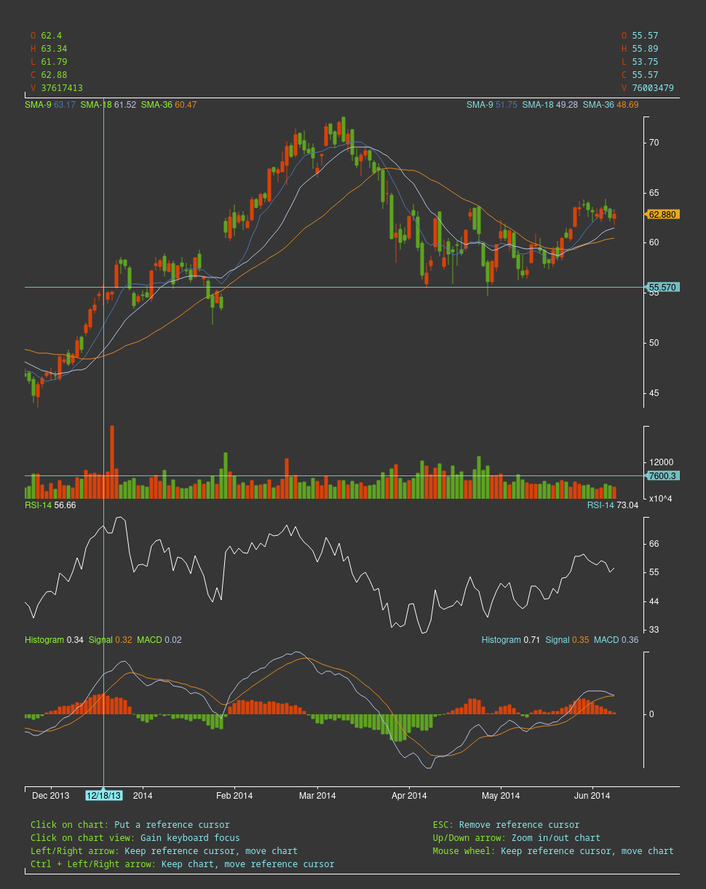

# VibeTrader 
Toward an Open Source AI-Friendly Trading Platform


## Help

### Shortcuts

#### Select symbol, timeframe
* Click on symbol: Select symbol
* Click on timeframe: Select timeframe

#### Move, Zoom
* Mouse:
  * Drag: Move chart
  * Ctrl + Drag: Scale chart
  * Double click on chart: Put a reference cursor
  * Double click on y-axis: Remove reference cursor
  * Wheel: Move chart
  * Shift + Wheel: Zoom in/out chart 

* Keyboard:
  * Left/Right arrow: Move chart
  * Ctrl + Left/Right arrow: Move reference cursor
  * ESC: Remove reference cursor / Hide crosshair
  * Up/Down arrow: Zoom in/out chart
  * Space: Swich fast/normal moving speed

#### Drawing
* Mouse:
  * Click on drawing: Select it
  * Ctrl + Click: Complete variable-handle drawing
  * Ctrl + Click on variable-handle drawing's handle: remove this handle
  * Ctrl + Drag on variable-handle drawing's segment: insert a handle

* Keyboard:
  * ESC: Unselect drawing
  * DELETE: Delete selected drawing

## Screenshot


## Build

```bash
npm install

npm run build
npm run preview
```
